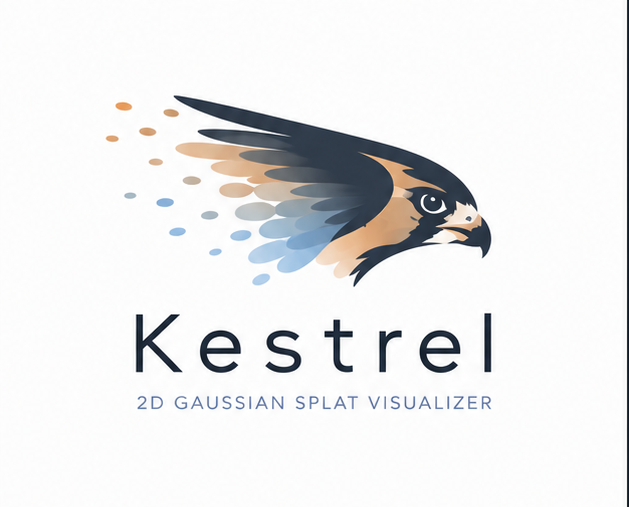
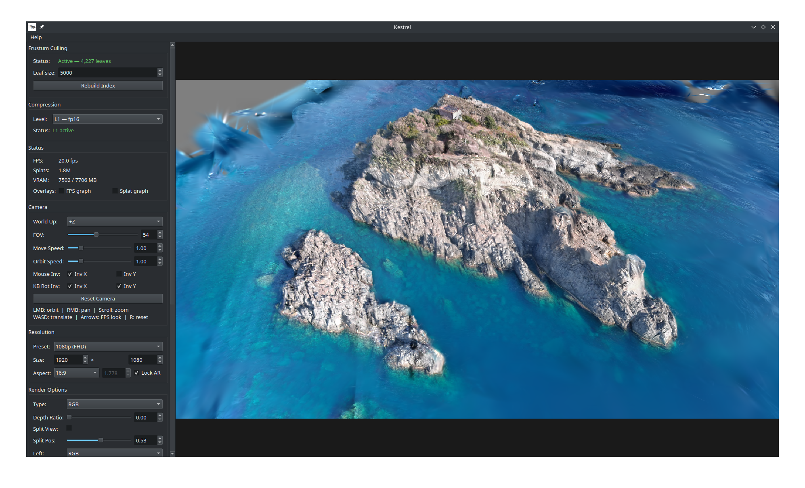
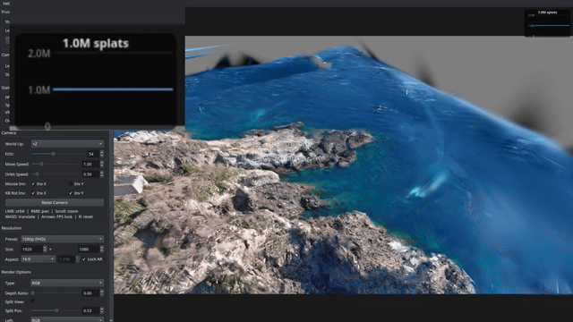
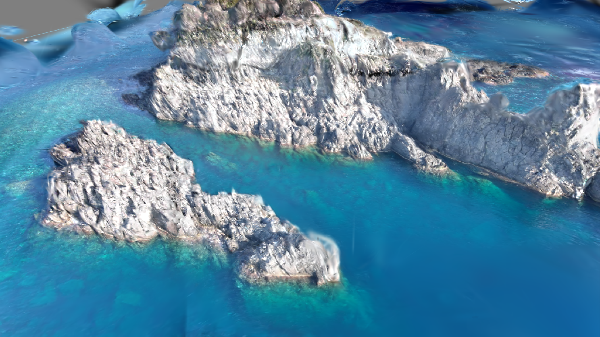
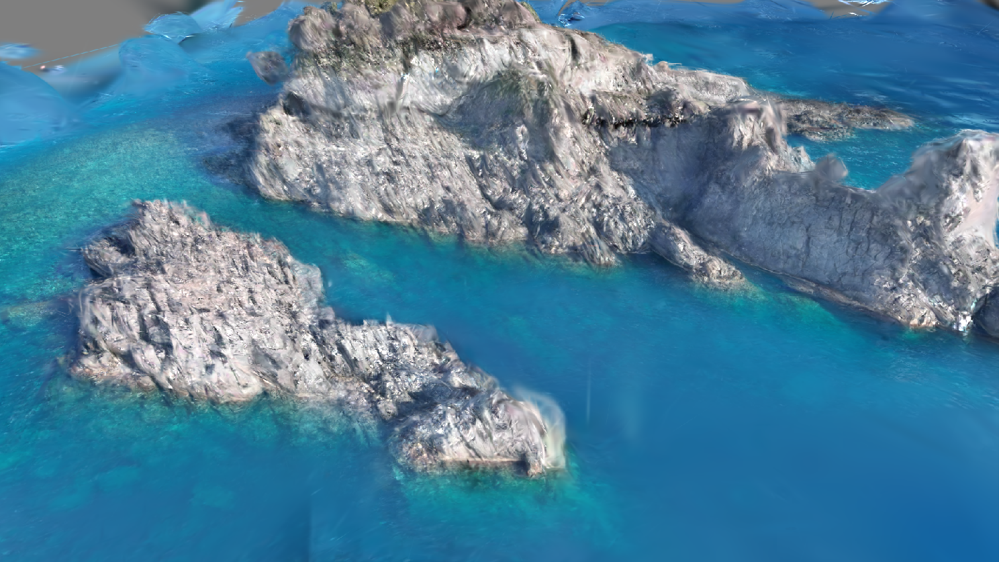
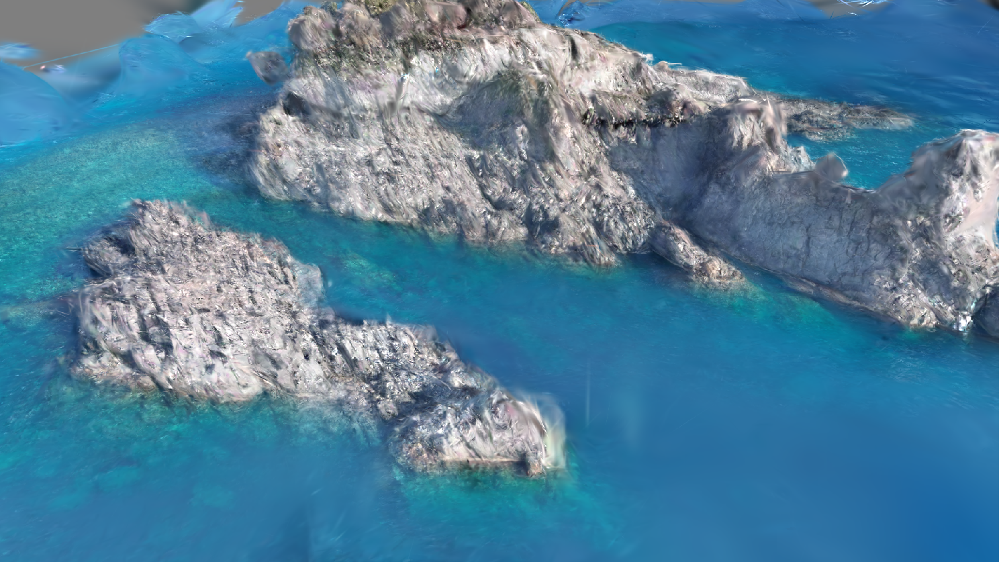
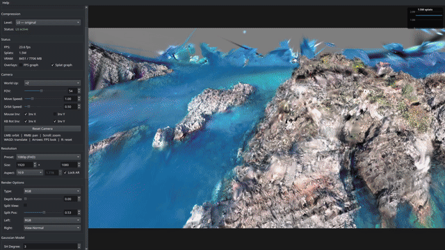
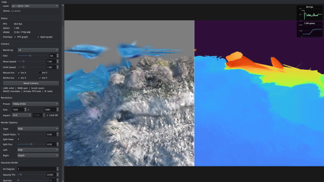

# Kestrel

<div align="center">
  
  <br/>
  <em>A native, real-time 2D Gaussian Splatting viewer for robotics and simulation pipelines</em>
</div>

---

Kestrel is a **local, single-window viewer** for [2D Gaussian Splatting](https://surfsplatting.github.io/) (surfel) models.

This project was born out of the lack of optimized Gaussian Splatting visualizers. While good viewers exist ([SIBR](https://github.com/JayFoxRox/SIBR_viewers), [Viser](https://github.com/mlisi1/2D-GS-Viser-Viewer)), they rarely allow fine-grained control over the splats, making scene inspection and rendering computationally expensive even on capable hardware.

Kestrel addresses this with a set of optimization and compression techniques that significantly reduce memory usage and render time, while keeping visual quality mostly unchanged.


## Features

+ **[Frustum culling](#frustum-culling)** — only the splats visible in the current view are passed to the rasterizer, cutting render time proportionally to the fraction of the scene culled.
+ **[Model compression](#compression)** — three levels of offline compression reduce memory footprint with minimal visual impact.
+ **[Real-time rendering](#render-types)** — RGB, depth, normals, curvature and more at interactive frame rates.
+ **[Split-view](#split-view)** — compare any two render types side by side with a draggable divider.
+ **[Crop box](#crop-box)** — axis-aligned bounding box filter to isolate regions of interest.
+ **[Persistent config](#persistent-configuration)** — global defaults + per-model camera pose, compression level, and all settings saved automatically.
+ **[Orbit + FPS camera](#camera-controls)** — mouse orbit/pan/zoom, WASD translate, arrow-key FPS look.


## Requirements

```
Python 3.9+
torch (CUDA)
numpy
plyfile
PyQt5
```

Kestrel's model loading, camera, culling/LOD, compression, profiling, SH evaluation, and
depth-to-normal all go through
[`gsplat2d-rendering`](https://github.com/mlisi1/gsplat2d-rendering), a git submodule of
this repo (`gsplat2d-rendering/`), installed editable alongside its own vendored CUDA
rasterizer submodule:

```bash
git submodule update --init --recursive
pip install -e gsplat2d-rendering
pip install -e gsplat2d-rendering/third_party/diff-surfel-rasterization
```

Install Python dependencies:

```bash
pip install -r requirements.txt
```


## Usage

### Load a PLY file

```bash
python main.py path/to/scene.ply
```

### Load from a training output directory

```bash
python main.py path/to/model_dir/
python main.py path/to/model_dir/ --iterations 30000   # specify checkpoint
```

Kestrel resolves `<model_dir>/point_cloud/iteration_<N>/point_cloud.ply` automatically.

### Build the frustum-culling index at startup

```bash
python main.py scene.ply --build-index
```

---

## Overview

<!-- TODO: insert screenshot or GIF of the main window -->


The window is split into a **sidebar** on the left and the **render canvas** on the right.
All controls live in the sidebar; the canvas captures mouse and keyboard input for camera navigation.

---

## Camera Controls

| Input | Action |
|-------|--------|
| **LMB drag** | Orbit around the look-at point |
| **RMB drag** | Pan the look-at point |
| **Scroll wheel** | Zoom (change distance) |
| **W / S** | Move look-at forward / backward |
| **A / D** | Strafe look-at left / right |
| **E / Q** | Translate camera + look-at along world-up |
| **Arrow keys** | FPS-style look in place (yaw / pitch) |
| **R** | Reset camera to origin |

Mouse inversion, orbit speed, move speed, and world-up axis (+Z, +Y, +X, …) are all
configurable in the **Camera** sidebar panel and persisted per model.


## Frustum Culling

<!-- TODO: insert GIF showing FPS improvement before/after building index -->


Kestrel builds an octree over the splat positions (via `gsplat2d_rendering.build_octree`).
Before each frame, a 5-plane Gribb–Hartmann frustum test runs directly on GPU over all
leaf nodes' bounding boxes (`gsplat2d_rendering.culling.visible_leaf_mask_torch`) and the
result drives a single boolean mask over the splats — skipping geometry that cannot be
visible.

On a **~5M-splat** scene, frustum culling reduces the active splat count from
**~2.2M to ~700K** per frame, bringing rasterization time from **~140ms down to
~20ms**.

Click **Build Index** in the *Frustum Culling* panel once; the index is saved to
`.kestrel/<stem>.idx` next to the PLY file and reloaded automatically.

> **Note:** the far plane is intentionally omitted from culling. Aerial scenes
> contain splats at large distances that the rasterizer handles correctly but a
> hard far-clip would discard.

**Rebuild** at any time if you change the leaf size (`--leaf-max`, default 5 000).

---

## Compression

<table>
  <tr>
    <td align="center">
      <br/>
      L0 (Original)
    </td>
    <td align="center">
      <br/>
      L1 compression
    </td>
    <td align="center">
      <br/>
      L2 compression
    </td>
    <td align="center">
      <br/>
      L3 compression
    </td>
  </tr>
</table>

Four compression levels are available in the **Compression** panel:

| Level | Storage | SH degree cap | File size | Quality loss |
|-------|---------|---------------|-----------|--------------|
| **L0** | original PLY | full | 1.2 GB | none |
| **L1** | fp16 | full | 1.2 GB | minimal (fp16 rounding) |
| **L2** | fp16 + SH degree 1 | 1 | 488 MB  | minor view-dependent lighting loss |
| **L3** | fp16 + int8 | 0 | 312 GB  | no view-dependent colour |

Benchmarked on a **5M-splat** aerial scene. L2 is the recommended default —
the SH degree reduction has negligible visual impact on most outdoor scenes while
halving memory usage.

Switching level compresses the PLY on a background thread and reloads the model
without blocking the UI. Compressed files are cached in `.kestrel/` and reused on
subsequent loads — compression runs only once per level per model.

> **Note:** performance figures shown are from benchmarks on a representative set of scenes. Actual speedup depends on scene size, splat density, and camera field of view.
## Render Types



Select the output image via the **Type** dropdown:

| Name | Description |
|------|-------------|
| **RGB** | Standard colour render |
| **Edge** | Gradient-magnitude edge map |
| **Alpha** | Accumulated opacity |
| **Normal** | World-space surface normals |
| **View-Normal** | Normals in camera space |
| **Depth** | Rendered surface depth |
| **Depth-Distort** | Depth distortion map |
| **Depth-to-Normal** | Normals derived from depth |
| **Depth-to-Curvature** | Surface curvature from depth |


## Split View



Enable **Split View** in the *Render Options* panel to compare two render types side by
side. Independent **Left** and **Right** dropdowns pick what each half shows; the
**Split Pos** slider (0 – 1) moves the vertical divider.


## Gaussian Model Controls

The **Gaussian Model** panel exposes per-frame render parameters:

| Control | Effect |
|---------|--------|
| **SH Degree** | Active spherical-harmonic bands (0 = diffuse only) |
| **Opacity Threshold** | Cull splats below this opacity — removes near-transparent debris |
| **Sparsity** | Render every Nth splat; useful for a quick preview on large models |
| **Scale** | Global splat size multiplier |
| **Pointcloud** | Render splat centres as points instead of Gaussians |
| **Disk mode** | Render oriented disk outlines (requires Pointcloud enabled) |
| **Point Size** | Radius of pointcloud markers |


## Crop Box

Enable **Crop Box** and drag the X / Y / Z min–max sliders to restrict rendering to
an axis-aligned bounding box. Useful for isolating a single object, a floor plane,
or a specific room.


## Resolution & Aspect Ratio

Choose a named preset (360p – 4K) or type a custom width × height. **Lock AR** keeps
the aspect ratio fixed when editing either dimension. The **Aspect** combo snaps to
standard ratios (16:9, 4:3, 16:10, 21:9, …).

The render resolution is independent of the window size — the canvas scales the output
image to fill the available area.


## Persistent Configuration

**Global config** (`~/.config/kestrel/config.json`) — default settings shared across
all models: FOV, speeds, mouse inversion, render type, overlays, etc.

**Per-model config** (`.kestrel/<stem>_view.json`) — everything in the global config
plus the camera pose (look-at, distance, yaw, pitch), active compression level,
split-view state, crop box, and pointcloud toggle. Saved on close, restored on open.


## `.kestrel/` Directory

All viewer artifacts for a given model are stored alongside the PLY file:

| File | Contents |
|------|----------|
| `<stem>.idx` | Octree frustum-culling index |
| `<stem>_L1.ply` | fp16-compressed PLY cache |
| `<stem>_L2.ply` | fp16 + SH-degree-1 PLY cache |
| `<stem>_L3.ply` | fp16 + int8-quantised PLY cache |
| `<stem>_view.json` | Per-model persistent state |


## CLI Reference

```
python main.py <ply_path> [options]

positional:
  ply_path              Path to .ply file or model directory

options:
  --iterations N        Checkpoint iteration when resolving model dir (default: 30000)
  --sh_degree N         SH degree override (-1 = auto-detect from PLY header)
  --build-index         Build / rebuild octree index at startup
  --leaf-max N          Max splats per octree leaf (default: 5000)
  --no-culling          Disable frustum culling even if an index exists
  --no-profiling        Suppress per-frame GPU timing output
  --fp16-load           Transfer tensors via fp16 during PLY load
```


## Acknowledgements

- **[2D Gaussian Splatting](https://surfsplatting.github.io/)** — Huang et al., 2024.
  *2D Gaussian Splatting for Geometrically Accurate Radiance Fields.*
- **[2D-GS-Viser-Viewer](https://github.com/hbb1/2d-gaussian-splatting)** — the viser-based
  viewer that inspired Kestrel.
